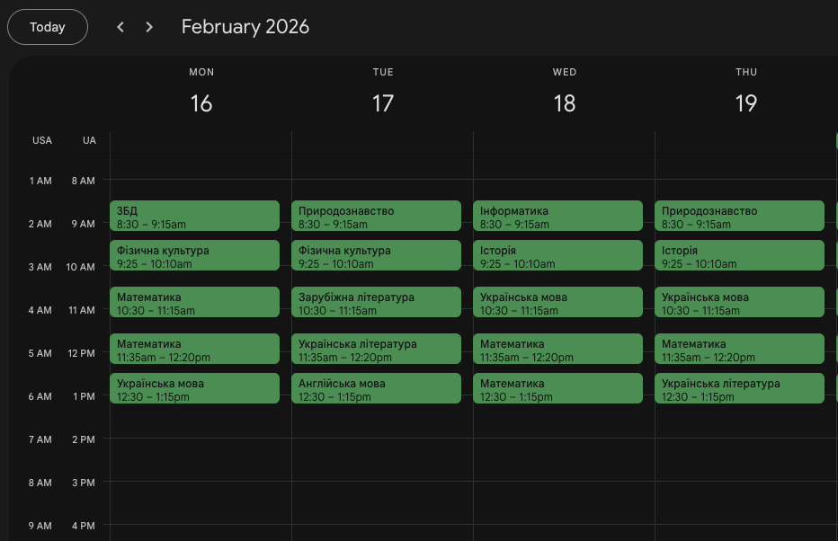
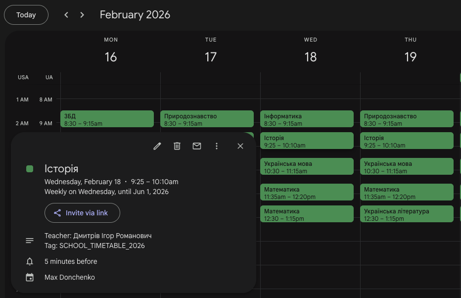

# School 63 Class 6A Timetable Sync

This project automates the process of adding a school timetable to Google Calendar for School 63, Class 6A. It uses the Google Calendar API to create recurring events for each lesson.




## Features

- **Automated Event Creation**: Creates recurring weekly events for the entire semester (until May 31, 2026).
- **Teacher Information**: Automatically adds the teacher's name to the event description.
- **Cleanup**: Easily remove all synchronized events using a cleanup script.
- **Authentication**: Handles Google OAuth2 authentication flow.

## Prerequisites

- Node.js installed.
- A `credentials.json` file from your Google Cloud Console (Desktop App).

## Usage

### 1. Installation

```bash
npm install
```

### 2. Synchronization

To create the events in your Google Calendar:

```bash
npm run create
```

Upon first run, it will open a browser window for Google authentication. After authorizing, copy the code and paste it back into the terminal.

### 3. Dry Run

To see what events would be created without actually making any changes or requiring authentication:

```bash
npm run create -- --dry-run
```

### 4. Deletion

To remove all events created by this script:

```bash
npm run delete
```

## Timetable Configuration

The timetable and lesson times are defined in `scripts/create.ts`.

### Weekly Schedule

- **Monday (MO)**: 3БД, Фізична культура, Математика, Математика, Українська мова
- **Tuesday (TU)**: Природознавство, Фізична культура, Зарубіжна література, Українська література, Англійська мова
- **Wednesday (WE)**: Інформатика, Історія, Українська мова, Математика, Математика
- **Thursday (TH)**: Природознавство, Історія, Українська мова, Математика, Українська література
- **Friday (FR)**: Англійська мова, Українська мова, Польська мова, Фізична культура, Образотворче мистецтво

### Lesson Times

1. 08:30 - 09:15
2. 09:25 - 10:10
3. 10:30 - 11:15
4. 11:35 - 12:20
5. 12:30 - 13:15
